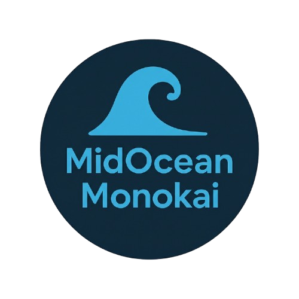

# MidOcean Monokai

A dark-themed custom **VS Code** color theme with ocean vibes — inspired by the classic Monokai palette, refined for modern developers.
<p align="center">
  
</p>

## Features
- Deep ocean blue background with soft syntax highlights  
- Easy on the eyes for long coding sessions  
- Polished version of Monokai for Django, Python, and REST API developers  

---


## Installation (Local)

1. **Clone the repository**
   ```bash
   git clone https://github.com/coderiver-labs/midocean-monokai-vscode-theme.git
   cd midocean-monokai-vscode-theme

2. **Build the VSIX file**
   ```bash
   npm install -g @vscode/vsce
   vsce package

   
**Note:** This command will generate a file named  `mid-ocean-monokai-1.0.0.vsix`

3. **Install the theme in VS Code**
   ```bash
   code --install-extension mid-ocean-monokai-1.0.0.vsix

## About

Created by **Coderiver Labs**  
A Django backend developer building tools and themes for devs who love clean design and calm colors.
